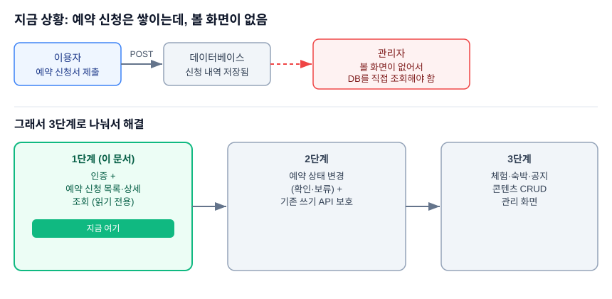
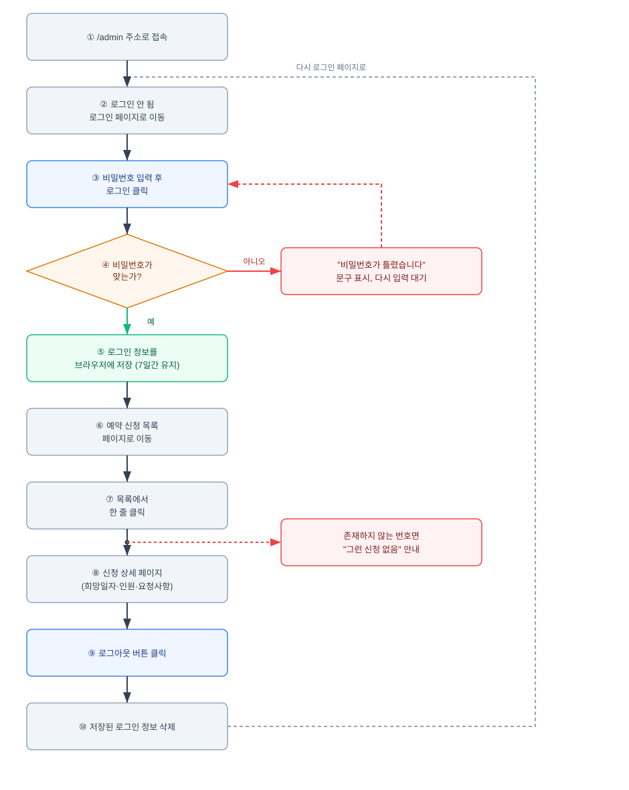
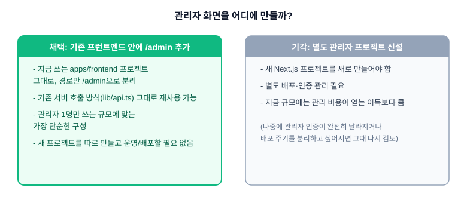
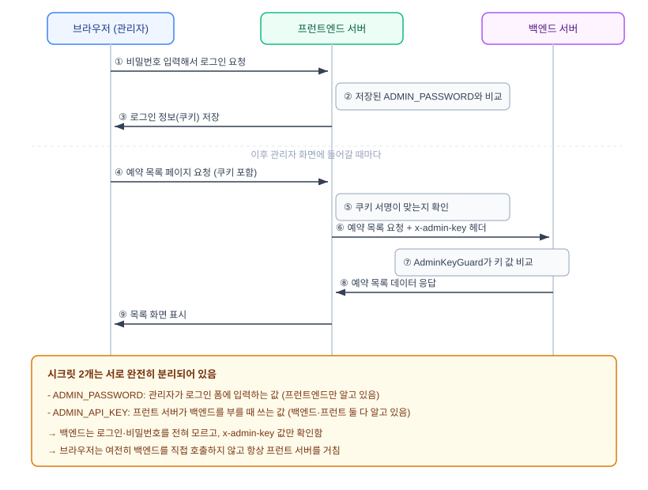
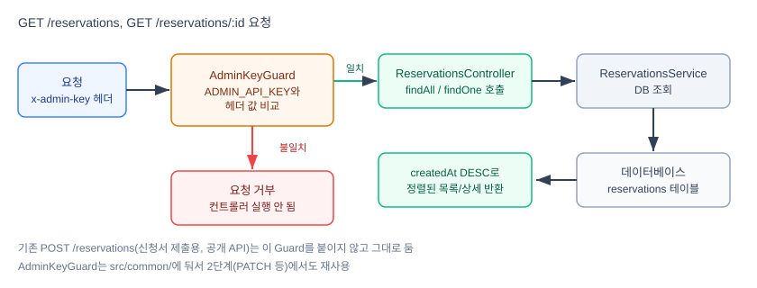
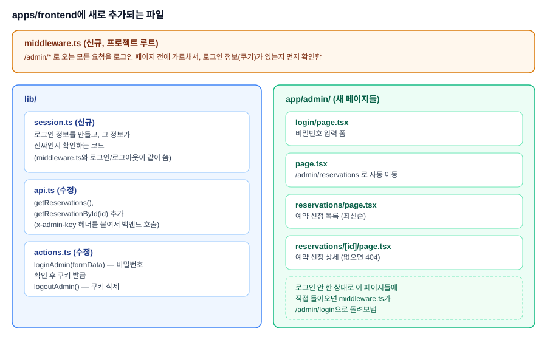
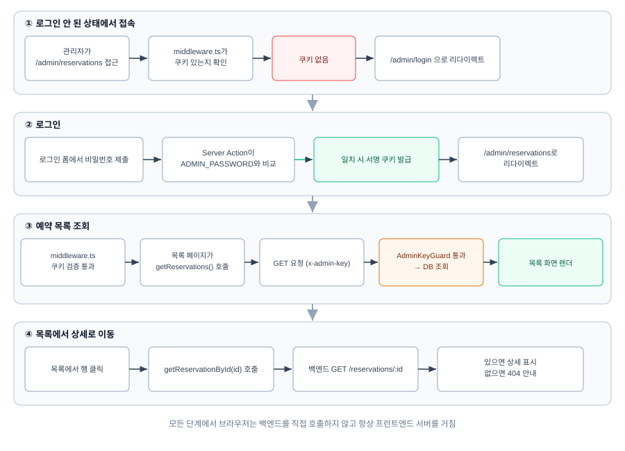
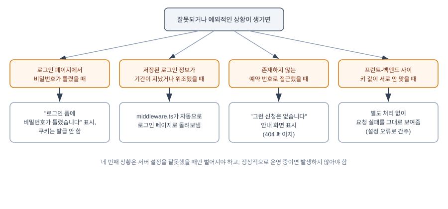
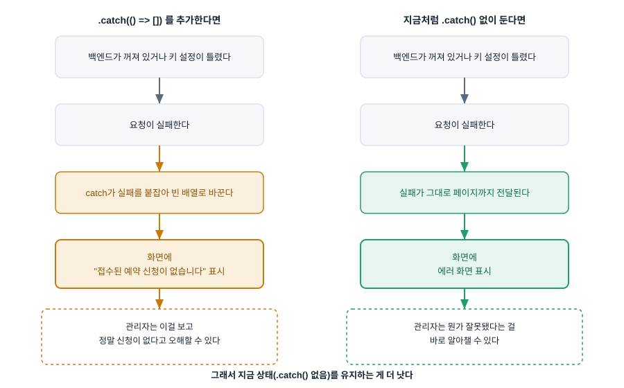
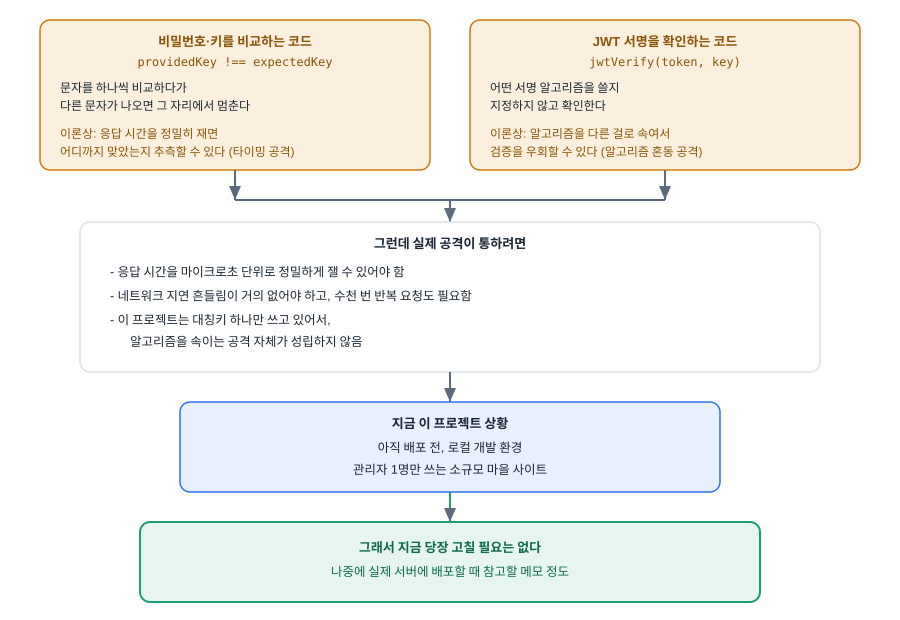

# 관리자 패널 1단계: 인증 + 예약 신청 조회 (읽기 전용)

## 배경 / 문제

예약 신청(`reservations` 모듈)은 `POST /reservations`만 존재해서 신청은 쌓이지만 확인할 화면이 없다. 현재는 DB를 직접 조회해야 한다. 관리자 패널 전체 범위(예약 관리 + 체험/숙박/공지 콘텐츠 관리)는 한 번에 설계·구현하기엔 크므로 3단계로 나눈다.

- **1단계 (이 문서)**: 인증 + 예약 신청 목록/상세 조회 (읽기 전용)
- 2단계: 예약 상태 변경(확인/보류) + 기존 쓰기 API(`POST /experiences` 등) 보호
- 3단계: 체험/숙박/공지 콘텐츠 CRUD 관리 UI

## 사용자 시나리오

이 기능을 실제로 사용하면 이런 순서로 진행됩니다.

1. 마을 관리자가 인터넷 주소창에 `우리사이트주소/admin`을 입력합니다.
2. 아직 로그인하지 않았기 때문에 화면이 자동으로 로그인 페이지로 바뀝니다.
3. 로그인 페이지에는 비밀번호를 입력하는 칸이 하나 있습니다. 관리자가 미리 정해둔 비밀번호를 입력하고 로그인 버튼을 누릅니다.
4. 입력한 비밀번호가 맞으면, 로그인 상태를 기억하기 위한 정보가 관리자의 컴퓨터(브라우저)에 저장됩니다. 이 정보는 7일 동안 유지되고, 7일이 지나면 다시 비밀번호를 입력해야 합니다.
5. 입력한 비밀번호가 틀리면, 화면에 "비밀번호가 틀렸습니다"라는 문구가 나오고 로그인이 되지 않습니다.
6. 로그인에 성공하면 화면이 자동으로 예약 신청 목록 페이지로 바뀝니다.
7. 예약 신청 목록 페이지에는 지금까지 들어온 예약 신청들이 최근 신청 순서대로 나열됩니다. 각 줄에는 신청 날짜, 체험 또는 숙박 이름, 신청한 사람 이름, 전화번호가 나옵니다.
8. 관리자가 목록에서 한 줄을 클릭하면, 그 신청의 자세한 내용을 볼 수 있는 페이지로 이동합니다. 이 페이지에는 신청자가 원하는 날짜, 인원 수, 요청 사항까지 모두 나옵니다.
9. 관리자가 존재하지 않는 신청 번호로 주소를 직접 입력해서 들어가려고 하면, "그런 신청은 없습니다"라는 안내 화면이 나옵니다.
10. 관리자가 로그아웃 버튼을 누르면, 저장되어 있던 로그인 정보가 지워지고 다시 로그인 페이지로 돌아갑니다.
11. 로그인하지 않은 상태에서 예약 목록 주소로 바로 들어가려고 하면, 화면이 자동으로 로그인 페이지로 이동합니다.

## 프로젝트 구조 결정

관리자 패널은 별도 프로젝트로 분리하지 않고 기존 Next.js 프런트엔드(`apps/frontend`) 안에 `/admin` 라우트 세그먼트로 구현한다. 미니 프로젝트 규모(단일 관리자, 배포처 미정)에서 별도 프로젝트는 인증·배포·의존성 오버헤드만 늘어난다. 관리자 인증 요구가 크게 달라지거나(SSO 등) 배포 주기를 분리하고 싶어지면 그때 분리한다.

## 사용자 / 범위

- 관리자는 마을 운영자 1인만 사용한다 (다중 계정 불필요).
- 1단계는 예약 신청 **조회만** 한다. 상태 변경, 콘텐츠 관리는 2·3단계로 미룬다.

## 인증 아키텍처

두 개의 분리된 시크릿을 사용한다.

- `ADMIN_PASSWORD` (프런트엔드 서버 전용 env) — 관리자가 로그인 폼에 입력하는 값
- `ADMIN_API_KEY` (백엔드 · 프런트엔드 공유 env, 동일 값) — 프런트 서버가 백엔드의 보호된 엔드포인트를 호출할 때 붙이는 서비스 간 시크릿 (`x-admin-key` 헤더)
- `SESSION_SECRET` (프런트엔드 서버 전용 env) — 로그인 세션 쿠키(JWT) 서명용

백엔드는 로그인/비밀번호를 전혀 모른다. 오직 고정된 `x-admin-key` 값만 검사한다. 브라우저는 여전히 백엔드를 직접 호출하지 않고 항상 프런트 서버를 거친다(기존 CORS 회피 원칙 유지).

**흐름**

1. `/admin/login`에서 비밀번호 입력 → Server Action이 `ADMIN_PASSWORD`와 비교
2. 일치하면 `jose`로 서명한 JWT를 HttpOnly 쿠키로 발급 (7일 만료, `SameSite=Lax`, 프로덕션에서 `Secure`)
   - JWT란: 로그인한 사람이 누구인지와 언제까지 로그인 상태가 유지되는지를 담은 데이터. 이 데이터에는 서버만 알고 있는 값으로 계산한 확인 값이 함께 들어있어서, 데이터 내용이 중간에 바뀌었는지 서버가 확인할 수 있음
   - `jose`란: 이 데이터를 만들고 확인하는 데 쓰는 프로그램(라이브러리). `jsonwebtoken`이라는 프로그램이 더 많이 쓰이지만, `middleware.ts` 코드가 실행되는 환경(Edge 런타임)에서는 `jsonwebtoken`이 작동하지 않아서 `jose`를 대신 사용함
3. `middleware.ts`가 `/admin/*`(로그인 페이지 제외) 요청마다 쿠키 서명을 검증. 없거나 만료/위조면 `/admin/login`으로 리다이렉트
4. 로그아웃 버튼 → 쿠키 삭제 Server Action

## 백엔드 설계 (`apps/backend`)

`reservations` 모듈에 추가:

- `GET /reservations` — 목록, `createdAt DESC` 정렬
- `GET /reservations/:id` — 상세, 없으면 404 (`NotFoundException`)

**보호**: `src/common/`에 재사용 가능한 `AdminKeyGuard` 신설.

- Guard란: 요청이 서버에 들어왔을 때, 실제 처리를 시작하기 전에 먼저 확인 절차를 거치게 만드는 장치. `@UseGuards(AdminKeyGuard)`를 엔드포인트에 붙이면, 요청이 올 때마다 이 확인 절차가 먼저 실행되고, 조건을 만족하지 못하면 실제 처리는 진행되지 않고 요청이 거부됨
- `CanActivate`란: Guard가 반드시 갖춰야 하는 형식을 정한 이름(NestJS 규칙). 이 요청을 통과시켜도 되는지 아닌지를 판단하는 함수 하나를 반드시 포함해야 함
- `AdminKeyGuard`의 판단 방법: 서버에 미리 저장해 둔 `ADMIN_API_KEY` 값과 요청에 담겨 온 `x-admin-key` 값이 같은지 비교함. 같으면 통과시키고, 다르면 요청을 거부함. `ConfigService`는 이렇게 서버에 저장된 값을 읽어오는 NestJS의 표준 도구

두 신규 엔드포인트에 `@UseGuards(AdminKeyGuard)` 적용. 기존 `POST /reservations`(사용자가 신청서 제출할 때 쓰는 공개 엔드포인트)는 그대로 둔다. 이 가드는 2단계(PATCH 상태 변경, 기존 쓰기 API 보호)에서도 재사용한다.

**서비스**: `ReservationsService`에 `findAll()`, `findOne(id)` 추가. 기존 `common/testing/mock-repository.ts` 패턴으로 유닛 테스트 작성 (`findAll`/`findOne`, `AdminKeyGuard`).

개인정보(신청자 이름/연락처)가 담기는 엔드포인트라 1단계부터 바로 보호한다 — 2단계로 미루지 않는다.

## 프런트엔드 설계 (`apps/frontend`)

- `middleware.ts` (신규, 루트) — `/admin/*`(로그인 페이지 제외) 요청마다 쿠키 검증, 실패 시 `/admin/login` 리다이렉트
- `lib/session.ts` (신규) — `jose` 기반 쿠키 서명/검증 헬퍼. `middleware.ts`와 로그인/로그아웃 Server Action이 공유
- `app/admin/login/page.tsx` — 비밀번호 입력 폼
- `app/admin/page.tsx` — `/admin/reservations`로 리다이렉트 (2·3단계에서 메뉴 페이지로 확장 가능)
- `app/admin/reservations/page.tsx` — 목록. 필터/검색 없이 최신순 단순 목록 (날짜/체험·숙박명/신청자명/연락처 표시, 행 클릭 시 상세로 이동)
- `app/admin/reservations/[id]/page.tsx` — 상세 (희망일자/인원수/요청사항 등 전체 필드), 없는 id는 `notFound()`
- `lib/api.ts`에 `getReservations()`, `getReservationById(id)` 추가 — 서버 전용 `ADMIN_API_KEY`를 `x-admin-key` 헤더로 첨부해 백엔드 호출
- `lib/actions.ts`에 `loginAdmin(formData)`(비밀번호 검증 + 쿠키 발급), `logoutAdmin()`(쿠키 삭제) 추가

### 신규 환경변수

- 백엔드 `apps/backend/.env` (커밋 안 함): `ADMIN_API_KEY`
- 프런트엔드 `apps/frontend/.env.local` (신규 파일, 커밋 안 함): `ADMIN_PASSWORD`, `ADMIN_API_KEY`(백엔드와 동일 값), `SESSION_SECRET`

## 데이터 흐름

1. 관리자가 `/admin/reservations` 접근 → `middleware.ts`가 쿠키 확인 → 없으면 `/admin/login`으로 리다이렉트
2. 비밀번호 제출 → Server Action이 `ADMIN_PASSWORD`와 비교 → 일치 시 서명 쿠키 발급 → `/admin/reservations`로 리다이렉트
3. `middleware.ts`가 쿠키 검증 통과 → 목록 페이지(서버 컴포넌트)가 `getReservations()` 호출 → 백엔드 `GET /reservations`(`x-admin-key` 헤더 포함) → `AdminKeyGuard` 통과 → `createdAt DESC`로 조회 → 목록 렌더
4. 행 클릭 → `/admin/reservations/[id]` → `getReservationById(id)` → 백엔드 `GET /reservations/:id` → 없으면 404 → `notFound()`

## 에러 처리

- 비밀번호 불일치 → 로그인 폼에 에러 문구 표시, 쿠키 발급 안 함
- 쿠키 만료/위조 → `middleware.ts`가 로그인으로 리다이렉트
- 존재하지 않는 예약 id → `notFound()` (404 페이지)
- `x-admin-key` 불일치(설정 오류 상황) → 별도 처리 없이 요청 실패를 그대로 노출 (개발 단계 설정 문제로 간주, 정상 운영 중엔 발생하지 않아야 함)

## 테스트

- 백엔드: `ReservationsService.findAll`/`findOne` 유닛 테스트(기존 mock-repository 패턴), `AdminKeyGuard` 유닛 테스트
- 프런트엔드: 기존과 동일하게 자동 테스트 프레임워크 없음 — 로그인/리다이렉트/목록/상세/로그아웃 흐름을 개발 서버에서 수동 확인

## 범위 밖 (다음 단계)

- 예약 상태 변경(확인/보류) — 2단계
- 기존 콘텐츠 쓰기 API(`POST /experiences` 등) 보호 — 2단계
- 체험/숙박/공지 CRUD 관리 UI — 3단계
- 목록 필터/검색/페이지네이션 — 신청 건수가 늘어나면 추후 추가

## 구현 완료 후 리뷰 참고 노트

구현이 끝난 뒤 최종 브랜치 리뷰에서 나온 항목 중, 당장 고치지 않고 그대로 두기로 한 두 가지를 기록해둔다.

### 1. 예약 목록 페이지에 `.catch()` 폴백이 없는 이유

`app/admin/reservations/page.tsx`는 다른 목록 페이지(`app/notices/page.tsx`)와 달리 `getReservations()` 호출에 `.catch(() => [])` 폴백을 붙이지 않았다. 백엔드 요청이 실패했을 때 빈 배열로 감싸면 화면에 "접수된 예약 신청이 없습니다"가 뜨는데, 이건 실제로 신청이 없는 것과 백엔드 장애·키 설정 오류를 구분할 수 없게 만든다. 지금처럼 실패를 그대로 노출해서 에러 화면이 뜨는 쪽이 관리자가 상황을 오해하지 않는 데 더 낫다고 판단해 그대로 두었다.

### 2. 비밀번호·키 비교 방식과 JWT 알고리즘 미고정

`AdminKeyGuard`와 `loginAdmin`의 비밀번호·키 비교는 단순 `!==` 비교라 이론상 타이밍 공격의 여지가 있고, `verifySessionToken`의 `jwtVerify` 호출은 서명 알고리즘을 명시적으로 고정하지 않았다. 두 항목 모두 이 프로젝트 규모(아직 배포 전, 로컬 개발, 관리자 1인, 대칭키 하나만 사용해 알고리즘 혼동 공격 자체가 성립하지 않음)에서는 실질적 위협이 아니라고 판단해 지금 단계에서는 고치지 않는다. 실제 서버에 배포할 때 다시 검토할 항목으로 남겨둔다.
