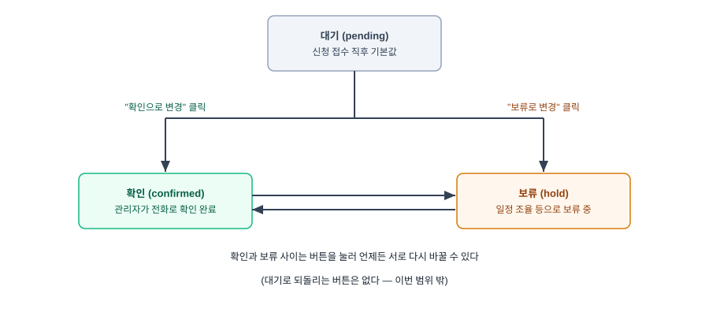
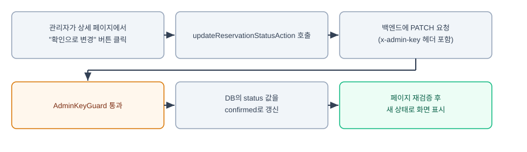

# 관리자 패널 2-B: 예약 상태 변경

## 배경 / 문제

1단계에서 관리자가 예약 신청을 조회할 수 있게 됐지만, 신청을 확인했는지 아직 보류 중인지 표시할 방법이 없어서 여전히 머릿속으로만 기억하거나 전화 메모에 의존해야 한다. 1단계 spec에서 2단계 범위로 잡아뒀던 "예약 상태 변경 + 기존 쓰기 API 보호" 중, 쓰기 API 보호는 2-A로 이미 완료됐고 이 문서는 남은 예약 상태 변경을 다룬다.

## 범위

- 예약 신청에 상태(대기/확인/보류) 개념을 추가하고, 관리자가 상세 페이지에서 상태를 바꿀 수 있게 한다.
- 목록 페이지에는 상태를 배지로 보여주기만 한다(변경은 상세 페이지에서만).
- "대기"로 되돌리는 기능이나 "취소/거절" 상태는 이번 범위에 포함하지 않는다.

## 상태 값 & 전이



세 가지 상태를 쓴다.

- `pending`(대기) — 신청이 접수된 직후의 기본값
- `confirmed`(확인) — 관리자가 전화로 확인을 마침
- `hold`(보류) — 일정 조율 등의 이유로 보류 중

상세 페이지에는 "확인으로 변경", "보류로 변경" 버튼 두 개가 현재 상태와 무관하게 항상 함께 보인다. 이미 확인 상태인 신청에서 "확인으로 변경"을 다시 눌러도 아무 문제 없이 같은 값으로 갱신될 뿐이다(멱등). 확인과 보류 사이는 이 두 버튼으로 언제든 서로 바꿀 수 있고, 대기로 되돌리는 버튼은 없다.

## 백엔드 설계

`Reservation` 엔티티(`apps/backend/src/reservations/entities/reservation.entity.ts`)에 컬럼 추가:

```typescript
@Column({ type: 'varchar', default: 'pending' })
status: 'pending' | 'confirmed' | 'hold';
```

`synchronize: true`라 서버 재시작 시 컬럼이 자동 추가되고, 기존 행에도 `default` 값이 채워진다.

새 엔드포인트: `PATCH /reservations/:id`

- 전용 DTO `UpdateReservationStatusDto`(`apps/backend/src/reservations/dto/update-reservation-status.dto.ts`)를 새로 만든다. `status` 필드 하나만 받고 `@IsIn(['confirmed', 'hold'])`로 검증한다. 기존 `PartialType(CreateReservationDto)` 관례를 따르지 않는 이유: 이 엔드포인트는 상태만 바꾸는 좁은 용도라 생성용 DTO의 나머지 필드(날짜, 인원 등)를 옵셔널로 열어둘 필요가 없다.
- `@UseGuards(AdminKeyGuard)` 적용(1단계·2-A와 동일한 가드 재사용).
- `ReservationsService.updateStatus(id, status)` 추가 — 없는 id면 `NotFoundException`.

## 프런트엔드 설계



- `apps/frontend/lib/api.ts`에 `apiPatchAdmin` 헬퍼(기존 `apiGetAdmin`과 같은 방식으로 `x-admin-key` 헤더 첨부, PATCH 메서드만 다름)와 `updateReservationStatus(id, status)` 함수를 추가한다.
- `apps/frontend/lib/actions.ts`에 `updateReservationStatusAction(id, status)` Server Action을 추가한다. `updateReservationStatus`를 호출한 뒤 `revalidatePath('/admin/reservations/${id}')`와 `revalidatePath('/admin/reservations')`를 둘 다 호출해서 상세 페이지와 목록 페이지 캐시를 모두 갱신한다.
- 상세 페이지(`app/admin/reservations/[id]/page.tsx`)에 현재 상태 배지와 버튼 두 개를 추가한다. 각 버튼은 `components/admin-logout-button.tsx`와 같은 방식으로 네이티브 `<form action={...}>`을 쓰되, `updateReservationStatusAction.bind(null, reservation.id, 'confirmed')`처럼 미리 인자를 묶어서(`bind`) 전달한다 — 클라이언트 JS가 필요 없다.
- 목록 페이지(`app/admin/reservations/page.tsx`)의 각 행에도 상태 배지를 추가한다(읽기 전용, 클릭 불가).
- 배지 색상: 대기는 회색, 확인은 초록, 보류는 주황 — 지금까지 이 프로젝트의 다이어그램/문서에서 써온 색 언어(성공=초록, 주의=주황, 중립=회색)와 맞춘다.

## 데이터 흐름

1. 관리자가 상세 페이지에서 "확인으로 변경" 버튼을 클릭한다.
2. `updateReservationStatusAction`이 호출되어 `updateReservationStatus(id, 'confirmed')`를 실행한다.
3. 프런트 서버가 백엔드에 `PATCH /reservations/:id`를 `x-admin-key` 헤더와 함께 호출한다.
4. `AdminKeyGuard`를 통과하면 `ReservationsService.updateStatus`가 DB의 `status` 값을 `confirmed`로 갱신한다.
5. Server Action이 관련 경로를 재검증해서, 페이지가 새 상태로 다시 렌더링된다.

## 에러 처리

- 잘못된 `status` 값(`confirmed`/`hold` 외의 값)이 오면 전역 `ValidationPipe`가 400으로 거부한다(기존 프로젝트 관례 그대로).
- 존재하지 않는 예약 id면 `NotFoundException`(404).
- 인증 실패(헤더 없음/불일치)는 1단계·2-A와 동일하게 `AdminKeyGuard`가 401로 거부한다.

## 테스트

- 백엔드: `ReservationsService.updateStatus` 유닛 테스트(기존 mock-repository 패턴) — 성공 케이스(확인/보류 각각), 존재하지 않는 id 케이스.
- 프런트엔드: 기존과 동일하게 자동 테스트 프레임워크 없음 — 상세 페이지에서 버튼을 눌러 상태가 바뀌고 목록 페이지 배지에도 반영되는지 개발 서버에서 수동 확인.

## 범위 밖

- 대기로 되돌리기, 취소/거절 상태 — 필요해지면 추후 별도로 논의
- 체험/숙박/공지 콘텐츠 CRUD 관리 화면 — 3단계
