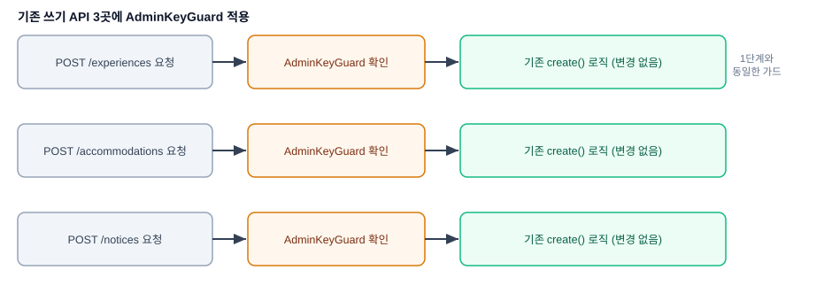

# 관리자 패널 2-A: 콘텐츠 쓰기 API 보호

## 배경 / 문제

`experiences`/`accommodations`/`notices` 모듈의 `POST` 엔드포인트는 주소만 알면 누구나 호출할 수 있는 상태다. 1단계 spec에서 이미 "2단계: 예약 상태 변경 + 기존 쓰기 API 보호"로 범위를 잡아뒀는데, 두 작업을 한 번에 하기엔 크다고 판단해 쓰기 API 보호만 먼저 분리해서 진행한다. 예약 상태 변경은 별도 spec(2-B)으로 이어서 진행한다.

## 범위

- `POST /experiences`, `POST /accommodations`, `POST /notices` 3개 엔드포인트에 1단계에서 만든 `AdminKeyGuard`(`apps/backend/src/common/guards/admin-key.guard.ts`)를 적용한다.
- 새 엔드포인트, DTO, 엔티티 변경은 없다.
- `src/seed.ts`는 TypeORM repository를 직접 호출해서 데이터를 넣는 방식이라(HTTP 요청이 아님) 이번 변경의 영향을 받지 않는다.
- 프런트엔드 변경은 없다 — 이 세 API를 호출하는 화면이 아직 없고(3단계에서 콘텐츠 CRUD 관리 화면과 함께 만들 예정), `seed.ts`도 위 이유로 영향이 없다.

## 백엔드 설계

각 컨트롤러의 `create()` 메서드에 `@UseGuards(AdminKeyGuard)`를 추가한다.

- `apps/backend/src/experiences/experiences.controller.ts`
- `apps/backend/src/accommodations/accommodations.controller.ts`
- `apps/backend/src/notices/notices.controller.ts`

세 컨트롤러 모두 같은 방식으로 바뀐다: `@Post()` 위에 `@UseGuards(AdminKeyGuard)`를 한 줄 추가하고, `AdminKeyGuard`를 import한다. `AdminKeyGuard`는 1단계에서 만든 것을 그대로 재사용하며, 어떤 모듈의 `providers` 배열에도 새로 등록하지 않는다(1단계와 동일한 이유 — `ConfigService`가 전역 등록돼 있어 `@UseGuards(클래스참조)`만으로 충분함).

## 데이터 흐름

1. 관리자용 클라이언트가 `x-admin-key` 헤더를 포함해 `POST /experiences`(또는 `/accommodations`, `/notices`)를 호출한다.
2. `AdminKeyGuard`가 헤더 값을 서버의 `ADMIN_API_KEY`와 비교한다.
3. 일치하면 기존 `create()` 로직이 그대로 실행된다(변경 없음).
4. 불일치하거나 헤더가 없으면 요청이 거부된다(1단계와 동일한 `UnauthorizedException`).

## 에러 처리

인증 실패 처리는 `AdminKeyGuard`가 이미 담당하며, 1단계와 동일하게 동작한다 — 새로 처리할 에러 케이스는 없다.

## 테스트

- 새로 추가되는 로직이 없다(가드 자체는 1단계에서 이미 유닛 테스트로 검증됨) — 이번 spec에서는 새 유닛 테스트를 추가하지 않는다.
- 백엔드 개발 서버를 띄운 뒤 curl로 세 엔드포인트 각각에 대해 확인한다: 인증 헤더 없이 호출 → 401, 잘못된 키로 호출 → 401, 올바른 `x-admin-key`로 호출 → 200(정상 생성).

## 범위 밖

- 예약 상태 변경 (2-B, 별도 spec)
- `PATCH`/`DELETE` 엔드포인트 신설, 콘텐츠 CRUD 관리 화면 (3단계)
